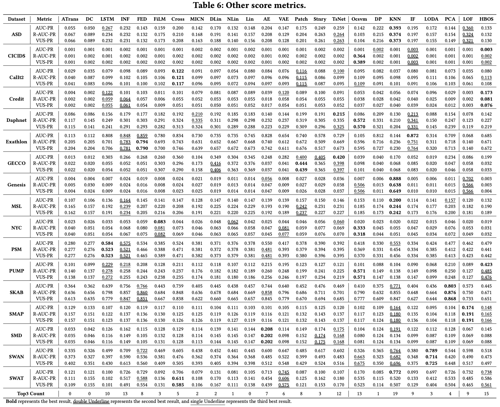
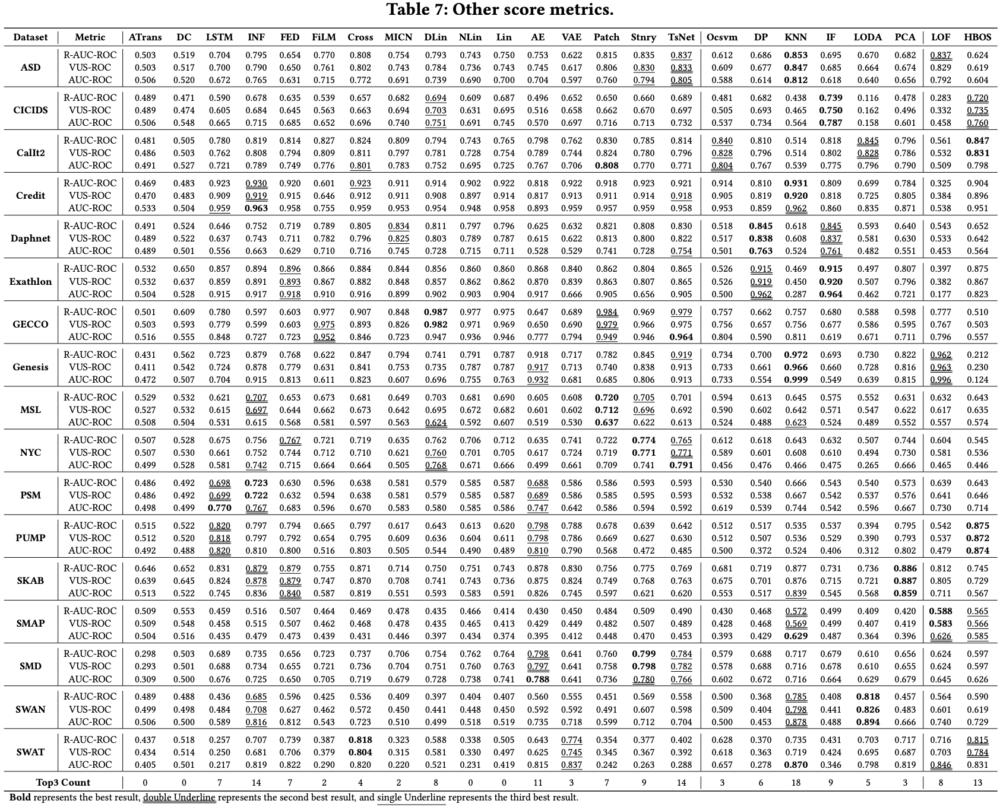
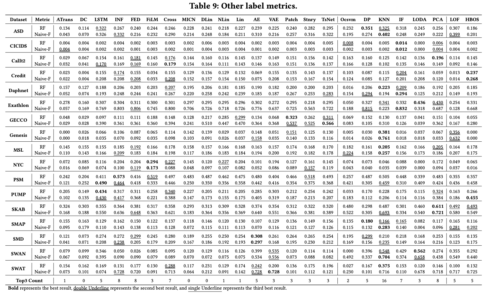

# <ins>T</ins>ime Series <ins>A</ins>nomaly Detection <ins>B</ins>enchmark (TAB)

**TAB is an open-source library designed for time series researchers.**

**We provide a clean codebase for end-to-end evaluation of time series anomaly detection models, comparing their performance with baseline algorithms under various evaluation strategies and metrics.**


## Quickstart

### Installation

Given a python environment (**note**: this project is fully tested under python 3.8), install the dependencies with the following command:

```shell
pip install -r requirements.txt
```


### Data preparation

Prepare Data. You can obtained the well pre-processed datasets from [Google Drive](https://drive.google.com/drive/folders/1WFuvKB9vmnXXH63-S9XAHgd3QB6SSDNu?usp=drive_link).Then place the downloaded data under the folder `./dataset`. 


### Train and evaluate model.

We provide the experiment scripts for all benchmarks. For example，you can reproduce a experiment result as the following:

```shell
python ./scripts/run_benchmark.py --config-path "unfixed_detect_label_config.json" --data-name-list "S4-ADL2.test.csv@79.csv"  --model-name "self_implementation.AnomalyTransformer" --model-hyper-params '{"batch_size":32, "lr":0.001, "num_epochs":20}'  --report-method csv --gpus 0 --num-workers 1 --save-path "AnomalyTransformer"
```

### Steps to develop your own method

1. **Define you model or adapter class**

  - The user-implemented model or adapter class should implement the following functions in order to adapt to this benchmark.


  - **The function prototype is as follows：**

    - required_hyper_params  function:

      ```python
      """
      Return the hyperparameters required by the model
      This function is optional and static
      
      :return: A dictionary that represents the hyperparameters required by the model
      :rtype: dict
      """
      # For example
      @staticmethod
      def required_hyper_params() -> dict:
          """
          An empty dictionary indicating that model does not require
          additional hyperparameters.
          """
          return {}
      ```

    
    - detect_fit  function training model
    
      ```python
      # For example
      def detect_fit(self, train_data: pd.DataFrame, train_label=None):
        """
        Training model
        :param train_data:
        :type train_data: pd.DataFrame
        :param train_label: Label of train_data[optional]
        :type train_label: pd.DataFrame
        """
        
        pass
      ```
    
    - detect_score function utilizing the model for inference
    
      ```python

      # For example
      def detect_score(self, data: pd.DataFrame) -> np.ndarray:
        """
        Use models for computing anomaly scores
        
        :param data: Training data to be detect
        :type data: pd.DataFrame
        
        :return: Anomaly scores for each time point
        :rtype: np.ndarray
        """
        
        return score
      ```
    
    - __repr __ string representation of function model name
    
      ```python
      """
      Returns a string representation of the model name
      
      :return: Returns a string representation of the model name
      :rtype: str
      """
      # For example
      def __repr__(self) -> str:
          return self.model_name
      ```
    

2. **Configure your Configuration File**

  - modify the corresponding config under the folder `./ts_benchmark/config/`.

  - modify the contents in  `./scripts/run_benchmark.py/`.

  - **We strongly recommend using the pre-defined configurations in `./ts_benchmark/config/`. Create your own  configuration file only when you have a clear understanding of the configuration items.**

3. **The benchmark can be run in the following format：**

```shell
python ./scripts/run_benchmark.py --config-path "unfixed_detect_label_multi_config.json" --data-name-list "PSM.csv" --model-name "self_implementation.DCdetector" --model-hyper-params '{"batch_size":16, "win_size":35,"anormly_ratio":1, "patch_size":[5,7], "num_epochs":5}' --report-method csv --gpus 0 --num-workers 1 --save-path "DCdetector"
```


## Example Usage

- **Define the model class or factory**
  - We demonstrated what functions need to be implemented for time series anomaly detection using the LOF algorithm. You can find the complete code in  `/ts_benchmark/baselines/self_implementation/LOF/lof.py`

```python
class LOF:
    """
    LOF (Local Outlier Factor) model class, used for anomaly detection.

    LOF is a density based anomaly detection method used to identify data points with significantly different densities compared to their neighbors in a dataset.
    """

    def __init__(
        self,
        n_neighbors: int = 20,
        algorithm: str = "auto",
        leaf_size: int = 30,
        metric: str = "minkowski",
        p: int = 2,
        metric_params: dict = None,
        contamination: float = 0.1,
        n_jobs: int = 1,
    ):
        """
        Initialize the LOF model.

        :param n_neighbors: Used to calculate the number of neighbors in the LOF.
        :param algorithm: The algorithm used for LOF calculation.
        :param leaf_size: The leaf size used when constructing KD trees or ball trees.
        :param metric: The distance metric used to calculate distance.
        :param p: The parameter p in distance measurement.
        :param metric_params: Other parameters for distance measurement.
        :param contamination: The proportion of expected abnormal samples.
        :param n_jobs: The number of worker threads used for parallel computing.
        """
        self.n_neighbors = n_neighbors
        self.contamination = contamination
        self.algorithm = algorithm
        self.leaf_size = leaf_size
        self.metric = metric
        self.p = p
        self.metric_params = metric_params
        self.n_jobs = n_jobs
        self.model_name = "LOF"

    @staticmethod
    def required_hyper_params() -> dict:
        """
        Return the hyperparameters required for the LOF model.

        :return: An empty dictionary indicating that the LOF model does not require additional hyperparameters.
        """
        return {}

    def detect_fit(self, X, y=None):
        """
        Train LOF models.

        :param X: Training data.
        :param y: Label data (optional).
        """
        pass

    def detect_score(self, X: pd.DataFrame) -> np.ndarray:
        """
        Use the LOF model to calculate anomaly scores.

        :param X: The data of the score to be calculated.
        :return: Anomaly score array.
        """
        X = X.values.reshape(-1, 1)

        self.detector_ = LocalOutlierFactor(
            n_neighbors=self.n_neighbors,
            algorithm=self.algorithm,
            leaf_size=self.leaf_size,
            metric=self.metric,
            p=self.p,
            metric_params=self.metric_params,
            contamination=self.contamination,
            n_jobs=self.n_jobs,
        )
        self.detector_.fit(X=X)

        self.decision_scores_ = -self.detector_.negative_outlier_factor_

        score = (
            MinMaxScaler(feature_range=(0, 1))
            .fit_transform(self.decision_scores_.reshape(-1, 1))
            .ravel()
        )
        return score

    def detect_label(self, X: pd.DataFrame) -> np.ndarray:
        """
        Use LOF model for anomaly detection and generate labels.

        :param X: The data to be tested.
        :return: Anomaly label array.
        """
        X = X.values.reshape(-1, 1)

        self.detector_ = LocalOutlierFactor(
            n_neighbors=self.n_neighbors,
            algorithm=self.algorithm,
            leaf_size=self.leaf_size,
            metric=self.metric,
            p=self.p,
            metric_params=self.metric_params,
            contamination=self.contamination,
            n_jobs=self.n_jobs,
        )
        self.detector_.fit(X=X)

        self.decision_scores_ = -self.detector_.negative_outlier_factor_

        score = (
            MinMaxScaler(feature_range=(0, 1))
            .fit_transform(self.decision_scores_.reshape(-1, 1))
            .ravel()
        )
        return score

    def __repr__(self) -> str:
        """
        Returns a string representation of the model name.
        """
        return self.model_name

```

- **Run benchmark using LOF**

  ```shell
  python ./scripts/run_benchmark.py --config-path "unfixed_detect_label_config.json"   --data-name-list "S4-ADL2.test.csv@79.csv"  --model-name "self_implementation.LOF" --gpus 0  --num-workers 1  --timeout 60000  --save-path "LOF"
  ```


## Experimental result

### Other metrics results








### Updated threshold results


### Adding rank results


### Adding top-3 results


## Acknowledgement

The development of this library has been supported by **Huawei Cloud**, and we would like to acknowledge their contribution and assistance.


